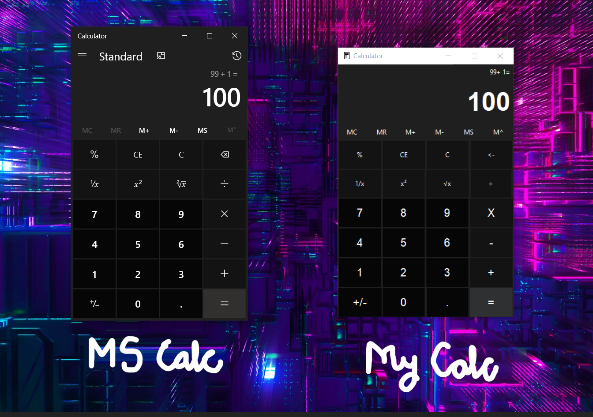

# MS-Calculator-gui
A exact replica of the Calculator GUI which comes bundled with MS Win10

## UI Comparison  
    

## Features to add
    * Miscellaneous calculator functions such as modulus, square root, inverse etc
    * Change button fg and bg color on mouse hover
    * Change button fg and bg color on mouse click
    * Keyboard input support
    * Capability to recall all the stored memory and operations with them

## Implementable future upgrades
    * Converter capabilities like mass, temperature, currency
    * Scientific calculator features
    * Programmer calculator features
    * Date calculation capability
